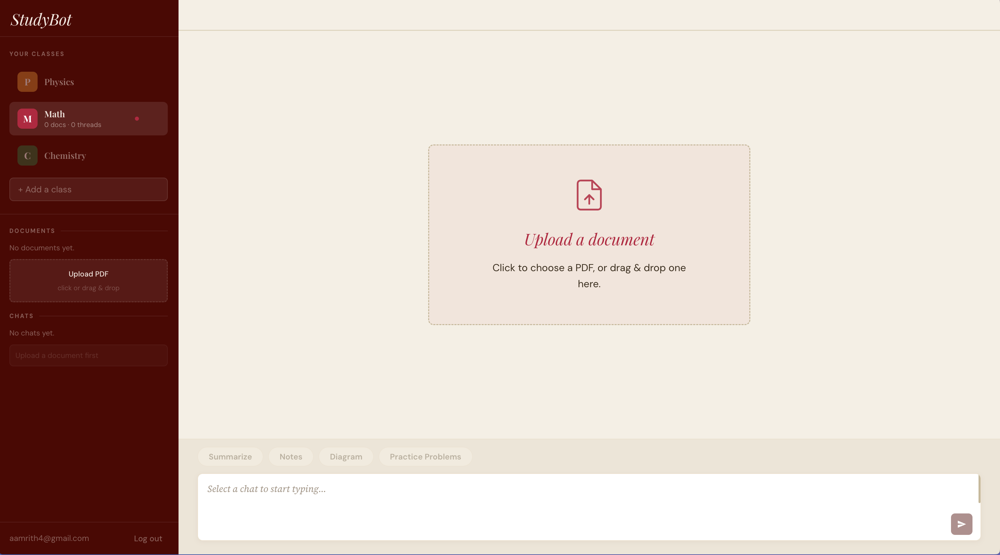
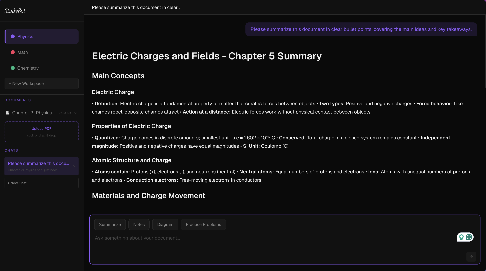
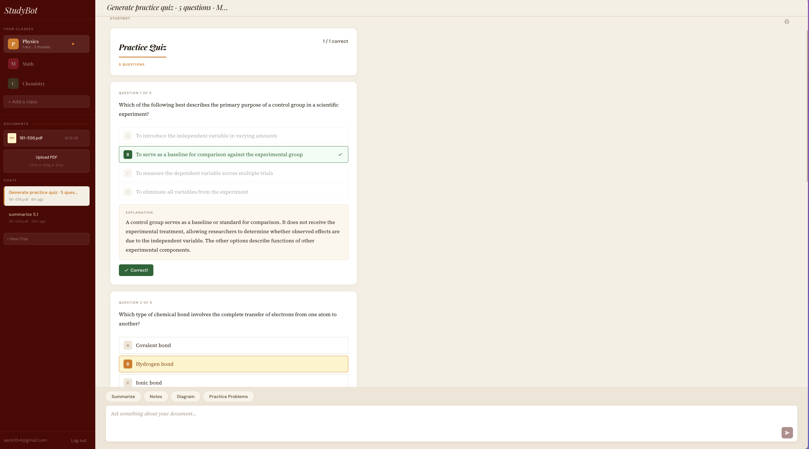
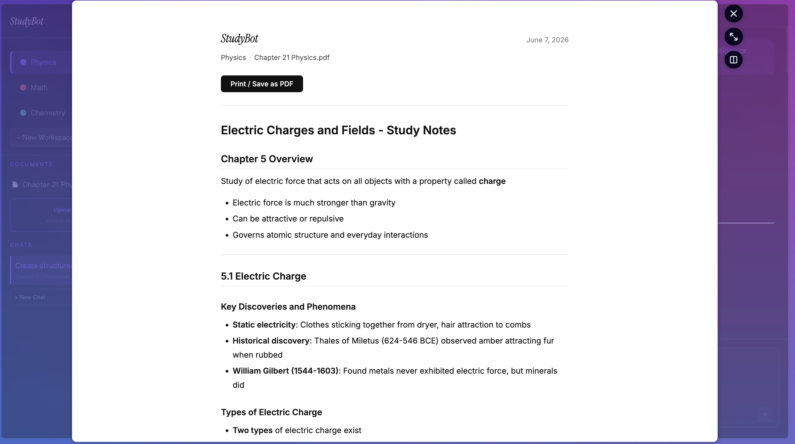

# StudyBot

An AI-powered study assistant that lets you upload course materials and interact with them through a smart chat interface. Built with React, Express, and the Anthropic Claude API.

**Live demo:** [study-bot-lovat.vercel.app](https://study-bot-lovat.vercel.app)

---

## Screenshots

### Workspace Dashboard


### AI Chat with Document Context


### Interactive Practice Quiz


### Print-Ready Study Notes Export


---

## Features

**Workspaces** — Organize your studying by class. Create a workspace for Physics, Math, Chemistry, or any subject. Each workspace has its own documents, chats, and a custom accent color that themes the entire UI.

**PDF Upload & AI Chat** — Upload a textbook chapter or lecture slides and ask anything about the material. StudyBot uses Claude as its AI backbone with prompt caching, so follow-up questions in the same session cost a fraction of a cent.

**Study Tool Shortcuts** — One-click prompts for the most common study tasks:
- **Summarize** — bullet-point summary of the document
- **Notes** — structured study notes organized by topic
- **Diagram** — Mermaid.js diagram illustrating a key concept
- **Practice Problems** — configurable interactive quiz (see below)

**Interactive Practice Quiz** — Generate multiple choice quizzes with a configurable number of questions and difficulty level (Easy / Medium / Hard). Questions render as a real quiz UI — select your answers, submit, and get instant grading with per-question explanations and a final score. No extra API calls needed after generation.

**Print-Ready Notes Export** — Any assistant response can be exported as a clean, print-formatted page with a single click. Includes workspace name, document name, and date. Useful for open-note exams.

**Mermaid Diagram Rendering** — When Claude returns a Mermaid diagram, it renders as an actual SVG diagram in the chat, not raw code.

**User Accounts** — Sign up with email/password or Google OAuth. Your data is stored in Supabase with Row Level Security, so each user can only ever see their own workspaces, documents, and chats.

**Session History** — Every chat is saved to Supabase with its title, timestamp, and full message history. Sessions persist across browser refreshes and devices, organized per workspace.

**Dynamic Accent Colors** — Each workspace has a user-chosen color (from presets or a custom color picker) that themes the sidebar, input focus ring, message bubbles, buttons, and section labels throughout the UI.

---

## Tech Stack

| Layer | Technology |
|---|---|
| Frontend | React 18, Vite |
| Backend | Node.js, Express |
| AI | Anthropic Claude API (claude-sonnet-4-20250514) |
| PDF Parsing | pdf-parse |
| Diagram Rendering | Mermaid.js |
| Markdown Rendering | react-markdown |
| Auth | Supabase Auth (email/password + Google OAuth) |
| Database | Supabase (Postgres + Row Level Security) |
| Frontend Deploy | Vercel |
| Backend Deploy | Railway |

---

## Architecture

```
StudyBot/
├── client/                  # React + Vite SPA (deployed to Vercel)
│   └── src/
│       ├── components/      # UI components
│       │   ├── AuthScreen.jsx      # Login / signup / Google OAuth
│       │   ├── Sidebar.jsx         # Workspace switcher + doc/chat lists
│       │   ├── ChatWindow.jsx      # Message list + auto-scroll
│       │   ├── MessageBubble.jsx   # User / assistant message rows
│       │   ├── MessageContent.jsx  # Markdown + Mermaid + Quiz detection
│       │   ├── Mermaid.jsx         # Mermaid SVG renderer
│       │   ├── Quiz.jsx            # Interactive multiple choice quiz
│       │   ├── PromptChips.jsx     # Study tool shortcut buttons
│       │   └── ChatInput.jsx       # Textarea + send
│       ├── context/
│       │   └── AuthContext.jsx     # Supabase Auth provider + useAuth hook
│       ├── hooks/
│       │   └── useWorkspaces.js    # Workspace state + Supabase sync
│       ├── lib/
│       │   ├── supabase.js         # Supabase client singleton
│       │   ├── db.js               # Supabase data-access layer (CRUD + hydration)
│       │   ├── storage.js          # Quota helpers (doc size warnings)
│       │   └── prompts.js          # Study tool prompt templates
│       └── api.js                  # Fetch wrapper for Express API
│
├── server/                  # Express API (deployed to Railway)
│   └── src/
│       ├── app.js                  # Express app + middleware + routes
│       ├── routes/
│       │   ├── upload.js           # POST /api/upload (PDF extraction)
│       │   └── chat.js             # POST /api/chat (Claude API)
│       └── services/
│           ├── pdf.js              # Text extraction with pdf-parse
│           └── claude.js           # Claude API with prompt caching
│
└── supabase/
    ├── migrations/
    │   └── 0001_init.sql           # Tables, indexes, RLS policies
    └── README.md                   # Dashboard setup runbook
```

**Key design decisions:**
- The Anthropic API key lives exclusively on the Express server and is never referenced in the client bundle
- Document text is sent as a cached system block, dramatically reducing per-message cost for follow-up questions
- All user data (workspaces, documents, chats, messages) is stored in Supabase Postgres with Row Level Security — data CRUD goes client → Supabase directly, while Claude API calls route through Express
- The Supabase anon key is safe to expose in the client bundle; RLS policies enforce per-user isolation at the database level
- Quiz grading and scoring happen entirely client-side after a single JSON generation call

---

## Local Development

### Prerequisites
- Node.js 18+
- An Anthropic API key ([console.anthropic.com](https://console.anthropic.com))
- A Supabase project (free tier works — see [`supabase/README.md`](supabase/README.md) for setup)

### Setup

```bash
# Clone the repo
git clone https://github.com/CodingMastermind123/StudyBot.git
cd StudyBot

# Install server dependencies
cd server
npm install
cp .env.example .env
# Add your ANTHROPIC_API_KEY to server/.env

# Install client dependencies
cd ../client
npm install
cp .env.example .env
# Add your VITE_SUPABASE_URL and VITE_SUPABASE_ANON_KEY to client/.env
# VITE_API_URL=http://localhost:8787 is already set
```

### Running locally

```bash
# Terminal 1 — start the backend
cd server
npm run dev

# Terminal 2 — start the frontend
cd client
npm run dev
```

Open [http://localhost:5173](http://localhost:5173) in your browser.

### Environment Variables

**server/.env**

| Variable | Description | Default |
|---|---|---|
| `ANTHROPIC_API_KEY` | Your Anthropic API key | Required |
| `PORT` | Port the Express server runs on | `3001` |
| `ALLOWED_ORIGIN` | CORS origin (your frontend URL) | Required |
| `CLAUDE_MODEL` | Anthropic model ID | `claude-sonnet-4-20250514` |
| `MAX_DOC_CHARS` | Max characters extracted from PDF | `40000` |

**client/.env**

| Variable | Description |
|---|---|
| `VITE_API_URL` | URL of the Express backend |
| `VITE_SUPABASE_URL` | Supabase project URL (from Project Settings → API) |
| `VITE_SUPABASE_ANON_KEY` | Supabase anon/public key (safe to expose — RLS is the security boundary) |

> **Note:** The Supabase **service-role key** is NOT used anywhere and must never be placed in the client.

---

## Deployment

### Backend — Railway

1. Create a new project on [Railway](https://railway.app) and connect your GitHub repo
2. Set the root directory to `server`
3. Add all variables from the table above under the Variables tab
4. Go to Settings → Networking → Generate Domain and copy the URL

### Supabase

See [`supabase/README.md`](supabase/README.md) for the full setup runbook (project creation, running the migration SQL, configuring Google OAuth, and setting redirect URLs).

### Frontend — Vercel

1. Import your repo on [Vercel](https://vercel.com)
2. Set the root directory to `client`
3. Add environment variables:
   - `VITE_API_URL` — your Railway domain
   - `VITE_SUPABASE_URL` — your Supabase project URL
   - `VITE_SUPABASE_ANON_KEY` — your Supabase anon/public key
4. Deploy

Then update `ALLOWED_ORIGIN` in Railway to your Vercel domain and redeploy. Railway needs **no** new environment variables for the Supabase migration.

Both platforms auto-deploy on every push to `main`.

---

## Roadmap

See [ROADMAP.md](ROADMAP.md) for planned features including:
- **v2** — RAG pipeline for full textbook uploads (LangChain.js + ChromaDB)
- **v3** — Live PDF preview panel with page navigation

---

## Security

- The Anthropic API key is never sent to or bundled with the frontend
- CORS is restricted to the configured `ALLOWED_ORIGIN`
- PDF upload is validated for file type and size server-side
- All user data is protected by Supabase Row Level Security — each table enforces `user_id = auth.uid()` on SELECT, INSERT, UPDATE, and DELETE, guaranteeing per-user isolation at the database level
- Only the Supabase anon (public) key is used in the client; the service-role key is never referenced
- **Future hardening (optional):** The Express Claude proxy currently accepts unauthenticated requests. To lock it down, the client could send the Supabase access token as `Authorization: Bearer` and Express would verify it with the project's JWT secret (`SUPABASE_JWT_SECRET`). This is not required because the proxy holds no user data and RLS protects all data access

---

## Author

Built by **Amrith Akshintala**
